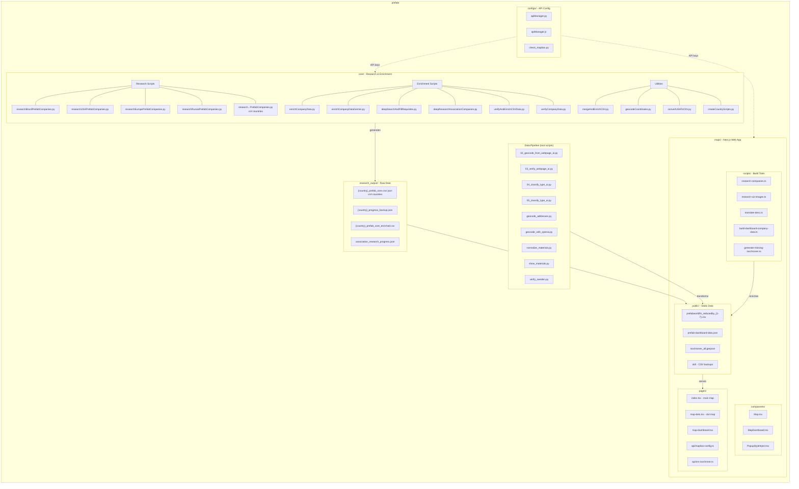
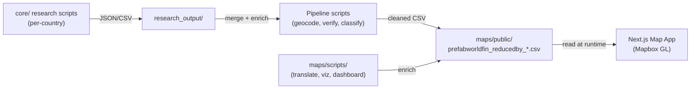

# Prefab Project - Architecture & Data Schema

## CSV Schema (`prefabworldfin_reducedby_7.csv`)

| # | Column | Type | Example |
|---|--------|------|---------|
| 1 | `id` | int | `11` |
| 2 | `brand` | string | `Casas Parana` |
| 3 | `head_office_legal_name` | string | `Construtora Casas Parana Ltda.` |
| 4 | `address` | string | `Rua da Industria, 348, Curitiba...` |
| 5 | `country` | string | `Brazil` |
| 6 | `country_code` | string | `BRA` |
| 7 | `region` | string | `Parana` |
| 8 | `webpage` | url | `https://www.casasparana.com.br` |
| 9 | `configurator` | url | online home configurator link |
| 10 | `models_amount` | int | `67` |
| 11 | `min_sqm` | float | `45` |
| 12 | `max_sqm` | float | `120` |
| 13 | `main_structure_material` | string | `wood`, `steel`, `concrete` |
| 14 | `min_home_price` | float | `16155.34` |
| 15 | `median_home_price` | float | `31360` |
| 16 | `latitude` | float | `-25.494963` |
| 17 | `longitude` | float | `-49.235489` |
| 18 | `type` | string | `homes` |
| 19 | `viz` | json[] | array of image URLs |
| 20 | `plans` | string | floor plan data |
| 21 | `sqm_ranges` | json[] | `[45,120]` |
| 22 | `median_u_price` | float | `380` (price per sqm) |
| 23 | `desc` | string | description (original language) |
| 24 | `desc_en` | string | description (English) |

---

## Project Architecture

---

## Data Flow

